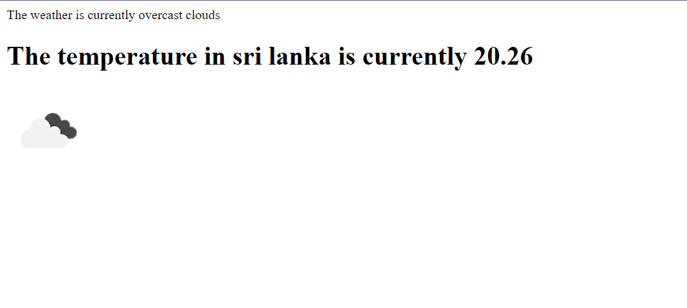

# Weather Application

The Weather Application is a web-based application that provides real-time weather information for locations around the world. It is built using Node.js, Express.js, and utilizes the Bodiphaser module for rendering weather icons. The application leverages the OpenWeather API to fetch current weather data.



## Features

- Search for weather information of any location.
- Display the current weather conditions, including weather icons and temperature.
- User-friendly interface with a simple and intuitive design.
- Real-time updates for weather data.

## Installation

1. Clone the repository:

```bash
git clone https://github.com/your-username/weather-app.git
```

2. Install the required dependencies:

```bash
cd weather-app
npm install
```

3. Sign up for an API key at [OpenWeather](https://openweathermap.org/) and replace `<YOUR_API_KEY>` in the `index.js` file with your actual API key.

## Usage

1. Start the application:

```bash
npm start
```

2. Open your web browser and go to `http://localhost:3000`.

3. Enter the name of the location you want to search in the search bar and click the "Search" button.

4. The application will display the current weather conditions for the entered location, including an appropriate weather icon and the temperature.

## Contributing

Contributions are welcome! If you have any ideas for improvements or encounter any issues, please open an issue or submit a pull request. Make sure to follow the project's code of conduct.

## License

This project is licensed under the [MIT License](LICENSE).

## Acknowledgements

- The Weather Application utilizes the [OpenWeather API](https://openweathermap.org/) to fetch weather data.
- The Bodiphaser module is used for rendering weather icons.


.
